# Temporal Alignment
## by Anton Dignös, Michael&nbsp;H.&nbsp;Böhlen, Johann&nbsp;Gamper

Paul A. Jungwirth<br/>
25 September 2024<br/>
Papers We Love Portland

Note:

- Thanks for coming!
- I'm Paul Jungwirth....
- independent consultant/programmer
- used Postgres since ~2010.

- I've been interested in temporal databases for more than ten years.
- I've read all the books in English and a lot of the papers.
- Almost every project I work on I wish I had easy temporal database support.

- This is the most interesting paper I know about temporal databases.
- A lot of stuff was standardized in SQL:2011,
  and I'm working on adding that to Postgres.
- But this paper goes way beyond what's in the standard,
  and it's practical enough to implement it.
- In fact as we'll see, the authors *did* implement it!


# Outline

- Background
- Temporal Relational Operators
- Postgres Implementation

Note:

- The challenge: so much to cover!
    - I've given an hour-long talk several times that could just be a preface to this paper.
    - I do need to give *some* background, so I've tried to condense that.
    - Hopefully most of the talk will be about the paper.


# The Problem
## Lost Information

<!-- .slide: style="font-size: 80%" -->
- finance: market data <!-- .element: class="fragment" -->
- questionnaires: changing questions, options <!-- .element: class="fragment" -->
- e-commerce: product price, other attributes <!-- .element: class="fragment" -->
- real estate: house renovations <!-- .element: class="fragment" -->
- employees: position, salary, employment period <!-- .element: class="fragment" -->

Note:

- The problem temporal databases solve is lost information.
  Whenever you UPDATE or DELETE, you lose what was there before.
- I've consulted with dozens of companies over the years,
  but I don't think a single one could re-generate a year-old report
  and get the same answers as before.
  - If you're talking about financial documents, that seems like a problem.
  - Finance seems to be a big one.
    - Hettie Dombrovskaya's has a Postgres extension originally built for this purpose.
    - XTDB (which is not Postgres) is built by finance people.
    - Lots of other examples.
  - One company built surveys to measure the effectiveness of social services.
    These were mostly multiple-choice questions, like "What is your ethnicity?"

    People were always changing the *questions* or the *choices* after they already had some answers.
    So when that happens, how do you trust your conclusions?
  - Or imagine an e-commerce site.
    If you didn't capture an item's price when it was sold,
    you could show a wrong order total later.
    Of course everyone does capture the price,
    but how about other product details, like color, category, etc.?
  - Note that both of these examples are causing errors across a foreign key:
    a child record didn't change, but its parent changed, and so in effect it changed too.
  - Or Zillow when a house changes.
  - Or (everyone's favorite database example): an employee's positions, salaries, projects, or tenure.

- Of course you can capture history if you want.
  - It's hard to capture *all* the history,
    but you need it all because in a database every table is connected.
  - I've seen a lot of ad hoc, partial, badly designed history solutions,
    all different and all with bugs.
    - For instance who uses soft-delete?
      In the Rails world people like to use a `deleted_at` column. Same thing in Django.
      But another table can hold a reference to a soft-deleted record.
      How do you restrict or cascade foreign keys with soft deletes?
      How do you systematically exclude soft-deleted records, without ever messing up?
      What if the record gets un-deleted later?
  - And soft deletes are actually pretty easy.
    It really falls down around joins, e.g. the issues across foreign keys above.


# Research

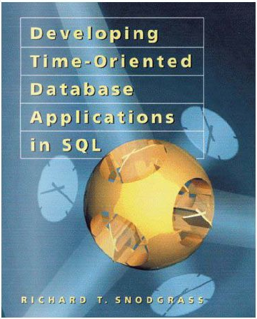

Note:

- Fortunately we've got 30+ years of research, we should use it!
- This is the first book about temporal databases, by Richard Snodgrass.
  - Well I recently discovered collection of academic papers he edited that's even earlier. I haven't read that one yet.
- Published in 1999, though my copy says copyright 2000.
- It shows how to do everything.
  - valid-time, system-time, bitemporal.
  - snapshot query vs sequenced vs non-sequenced
    - The paper uses this terminology of "sequenced" vs "non-sequenced".
      - "sequenced" means each tuple has a valid start/end time.
      - "non-sequenced" means timestamps don't have any special meaning.
        Snodgrass gives the example of a birthday,
        but the paper uses it to for copies of the start/end time,
        so that those attributes are accessible to join conditions and aggregate functions,
        even after the start/end times have been changed.
  - inner join vs outer join

  - It gives SQL for everything.
    - If you are building a temporal database in Informix or UniSQL, he's got you covered.
    - Also Oracle, DB2, Access, and MS SQL Server.

- Snodgrass led a standardization effort back in the 90s that didn't quite succeed.
  - Some say SQL:2011 is based on that, but not completely.
  - His approach is an important background for this paper, because the paper is such a massive improvement.
    - One of his goals was that you can take a database with non-temporal tables, then convert them to temporal tables without redesigning your application.
      - Your old queries still work, because by default everything handles "current" time and ignores historical records.
      - Then there is some new SQL syntax to deal with history only when you want.
      - This works by using "statement modifiers":
        - You say at the top of the query if you want sequenced semantics instead of current.


# Research

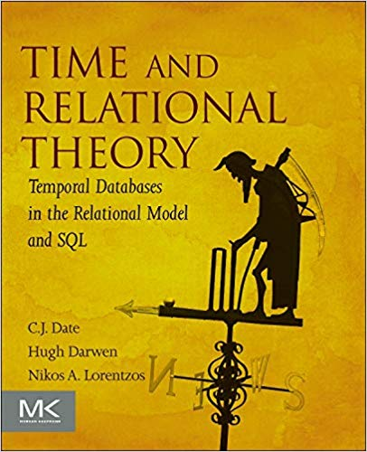

Note:

- Here is Date/Darwen/Lorentzos:
  - This book has the most formal, rigorous approach I've found.
  - Their idea is that ideally you'd have one row per second (or millisecond or whatever),
    and then you don't need anything special: everything just works.
  - We use intervals to abbreviate that as an optimization, but the ideal model often helps answer questions about how they should function.
  - What Date called intervals inspired Postgres range types.
- This is probably my favorite of all the temporal books.

- Date heavily criticized Snodgrass's "statement modifiers" approach.
  - He was worried it took SQL too far from its roots in relational theory.
  - One of the practical problems is composability: the statement level is too coarse.
  - If you know Date, you know that is kind of a relational zealot.
    - He wrote what is probably the leading database textbook,
      but he's spent decades telling people to avoid SQL because it has NULLs and duplicate records.
    - Of course no NULLs also means no outer joins.


# Research
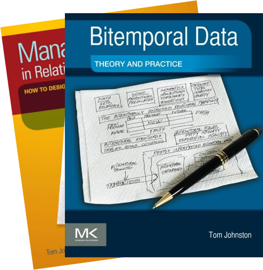

Note:

- Johnston has two books, one co-authored by Randall Weiss.
- The blue one is way more interesting.
- They have some extensions to MS SQL Server to do temporal stuff for you.
- He also doesn't quite like the standard and deviates from it in some ways.
- These books are not so important for tonight's paper.


# Temporal<br/>`IS DISTINCT FROM`<br/>Time-Series
<!-- .slide: style="font-size: 70%" -->

time-series | temporal
----------- | --------
single timestamp | two timestamps
records events       | records things, "versions"
IoT sensors, finance | auditing, history
challenge is scale   | challenge is complexity
partitioning         | ranges, exclusion constraints
TimescaleDB          | `periods`, `pg_bitemporal`

Note:

- To start with, a temporal database is not the same as a time-series database.
- Nowadays time-series is all the rage, with web analytics, advertising, IoT sensor data, APM metrics.
- Temporal is something else.
- In time-series every record has a single time stamp; in temporal every record has two: start & end.
- In time-series you record events; in temporal, things (different versions throughout the thing's lifetime)
- Challenges:
  - time-series: scale (but the structure is simpler)
  - temporal: moderate scale, but lots of complexity. Correctness is a challenge.
- Tools in Postgres:
  - timeseries: partitioning
  - temporal: ranges, exclusion constraints: very solid foundation, but no higher-level concepts yet
- Products in Postgres:
  - timeseries: Citus, TimescaleDB
  - temporal:
    - Teradata has had support for a long time
    - `temporal_tables` extension gives you one dimension (db history) but not the other (thing history).
    - Vik Fearing has an extension that gives application-time support. It's called just `periods`, so it's hard to search for.
    - Hettie Dombrovskaya has an extension on github too.
      - She's been working with temporal data for years and has lots of talks on it.
      - Turns out her husband, Boris Novikov, does temporal work too.


# Two Dimensions
<!-- .slide: style="font-size: 60%" -->

Application Time | System Time
-----------------|------------
history of the thing | history of the database
application features | auditing, compliance
user can edit        | immutable
maintained by you | maintained by Postgres
constraints matter | look Ma, no hands!
`periods`, `pg_bitemporal` | `temporal_tables`, `pg_audit_log`
nothing | Rails: `papertrail`, `audited`, `chronomodel`, ...

Note:

- In fact there are two kinds of history we'd like to track. (Maybe more!)
- There is system time, which is kind of like "who changed what when?".
  - When did the *database* change?
  - Actually SQL:2011 doesn't give you "who", only "what" and "when".
  - Lots of people need this for auditing and compliance.
  - There are lots of extensions for this, or it's not hard to build some triggers yourself.
  - Your database just sort of maintains it for you in the background.
- Then there is application time, which is when the thing changed out in the world.
  - You the application developer have to maintain this history yourself.
    - Maybe you expose this to your users too.
  - This is a lot trickier.
  - System time doesn't really require temporal containts, but this does.
  - You need temporal updates and deletes.
  - You really want some database help here.
  - Not many tools support this. Postgres has the two I mentioned.

- If you combine both in one table, that's call bi-temporal.

- Tonight's paper is only concerned with application time.


# Terminology
<!-- .slide: style="font-size: 80%" -->

|||&nbsp;
-|-|-
Snodgrass | valid time | transaction time
Fowler    | actual time | record time
Date/Darwen/Lorentzos | stated time | logged time
Johnston | effective time/<br/>state time | assertion time
SQL:2011 | application time | system time

Note:

- Btw, no one agrees on terminology.
  - Johnston's two books don't even agree with each other.
- There is actually a document called "The Consensus Glossary of Temporal Database Concepts" . . . from 1998.
- The paper uses the term "valid time", which is my preferred term also.


# Simple example
<!-- .slide: data-transition="slide none" -->

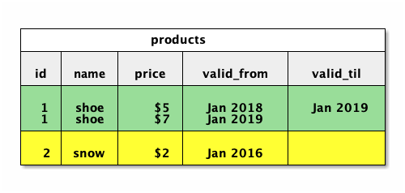

 <!-- .element: class="fragment" -->

Note:

- So what does a temporal table even look like?
- It gets two extra columns for start & end time.
- A blank value means unbounded or infinite.
  - You could also use sentinels like Jan 3000.
- It's nice to plot this on a timeline (next slide).
- Shocking that the primary key is not unique. (But tonight's paper isn't about that.)


<!-- .slide: data-transition="none slide" -->
# Simple Example

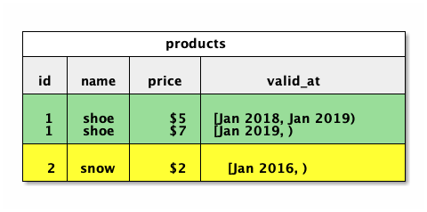


Note:

- We can make a nice refinement here, using Postgres range types.
- We go from two columns to one.
- Tonight's paper also uses Postgres range types.
- The funny mismatched brackets indicate "closed/open" semantics.
- That's the convention in temporal data, because then ranges "snap together".
- Range types have many advantages over two columns:
  - Lots of built-in operators
  - You can have a range on any type you want.
    - Builtin date/timestamp/int, but you can define a floatrange, or even e.g. my inetrange extension.
  - Ranges are indexable by GiST.


# SQL:2011
<!-- .slide: style="font-size: 70%" -->

- `PERIOD FOR valid_at (valid_from, valid_til)`

#### Constraints
<!-- .element style="text-align:left; margin:1.1em 0 0.4em 0" -->

- `PRIMARY KEY (id, valid_at WITHOUT OVERLAPS)`
- `UNIQUE (id, valid_at WITHOUT OVERLAPS)`
- `FOREIGN KEY (employee_id, PERIOD valid_at) REFERENCES employees (id, PERIOD valid_at)`

#### DML
<!-- .element style="text-align:left; margin:1.1em 0 0.4em 0" -->

- `UPDATE t FOR PORTION OF valid_at FROM x TO y`
- `DELETE FROM t FOR PORTION OF valid_at FROM x TO y`

Note:

- So the SQL:2011 standard gives you a few basic things:
    - primary key and unique constraints
    - foreign key
    - temporal update
    - temporal delete

- Then you have this PERIOD thing at the top.
    - Everything else is built on it.
- Range types are only in Postgres, so of course the standard had to do something else.
  - A PERIOD is kind of like a column, but it's not a column.
  - It's some table metadata which says that a start column and an end column are related.
    - In this first line we're declaring a period on our table, based on the columns `valid_from` and `valid_til`.
    - Then all the temporal commands use the PERIOD name.
    - But since it's not really a column, PERIODs are much more limited:
        - It's not part of the relational model.
        - Date has written a lot about the problems here.
        - Maybe they are not as bad as satement modifiers, but they are still pretty bad.
        - You can't select them, put them in a VIEW, pass them to a function, get them from a function, use them in your join condition (eh well I should double-check that....), use them in GROUP BY or HAVING, etc.
        - There are a few special-case predicates the standard gives you that you can put in WHERE.
            - Last time I checked, the vendors who supported PERIODs hadn't implemented those predicates.
            - I mean it's annoying to build a bunch of special cases for this identifier that's not a column.
    - Tonight's paper uses rangetypes.
        - Typically this is a T, then they have T-sub-s and T-sub-e for the bounds.
- In fact SQL:2011 does still use statement modifiers when it comes to system time, just not application time.
    - You say "AS OF" in your SQL to query non-current system time.
    - Personally this doesn't bother me to too much, because system time is kind of magical already.
    - Anyway tonight's paper is about application time.
- For application time, you don't have statement modifiers, and you don't have anything!
- An inner join isn't too hard to implement.
- There is nothing for outer joins, semijoins, antijoins, or aggregates.
- Even 13 years after the standard, there is still nothing.
- But this paper adds everything we're missing.


# Full Example

 N  |  T
--- | -----------------
Ann | [2012-01,2012-08)
Joe | [2012-02,2012-06)
Ann | [2012-08,2012-12)
<!-- .element: style="float:left; font-size:80%" -->

 A  | Min | Max | T
--- | --- | --- | -------
 50 |   1 |   2 | [2012-01,2012-06)
 40 |   3 |   7 | [2012-01,2012-06)
 30 |   8 |  12 | [2012-01,2013-01)
 50 |   1 |   2 | [2012-10,2013-01)
 40 |   3 |   7 | [2012-10,2013-01)
<!-- .element: style="float:right; font-size:80%" -->

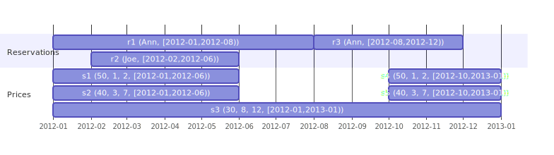

Note:

- For instance outer joins.
    - That's probably the hardest missing part.
- This is the example used throughout the paper.
- It takes some explanation, but it's important enough to dwell on it a bit.
- The first table is P or Prices.
- The second table is R or Reservations.
- Ann has two reservations, back-to-back.
- Joe has another reservation.
- Below I've shown that on a timeline.
    - You can see r1, r2, and r3.

- In the pricing table, the idea is that we give discounts for longer reservations.
- Min & Max are the number of months to qualify for that price.
- So the two rows are valid from January to June.
    - If you stay 1 or 2 months, you pay $50/day.
    - If you stay 3-7 months, you pay only $40/day.
- The last two rows are the same thing, but from October to January.
    - Again it's $50 for 1-2 months, $40 for 3-7.
- But if you stay 8-12 months, it's only $30/day.
    - That's the middle row.
    - This pricing is valid year-round.
- And again, all this is on our timeline.
    - s1 and s2 are early in the year.
    - s4 and s5 are late in the year.
    - s3 is valid across the whole year.
- So how much do we charge someone?
    - We need to do a join.
    - In fact it is an outer join, because for some months we don't even have a price. As the paper says, we need to "negotiate".
    - This is a very clever example, because it's not just an outer join, it's not just a temporal outer join, it's a temporal outer join whose join condition has to match up the reservation duration against these min and max values. The join condition---what we usually call theta---references the start/end times. Just keep that in mind.


# Full Example

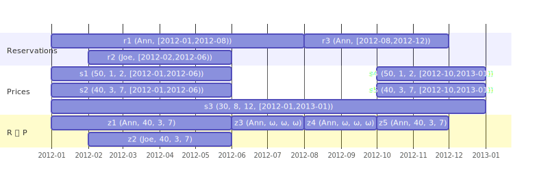

Note:

- Here is the result we want.
    - All the same inputs are at the top, but I've added the result to the bottom.
- Take a look at how the start & end times of the answers don't exactly match the inputs.
- r1 gives us z1 and z3.
- r3 gives us z4 and z5.
- z3 and z4 have NULLs for the price data, because there was no match there.
    - z3 and z4 are identical, but z3 comes from r1, and z4 comes from r3.
- Also look at how z5 only extends as far as r3, even though we have pricing data past that data.
- Then z2 is a pretty simple case: from one reservation record you get one result.
    - But again we're not using all the pricing record.

- This is the kind of thing we want to be able to do: not just for outer joins, but all kinds of things.


# Group-Based Operators
<!-- .element class="r-fit-text" -->

- Many input tuples
- One output tuple

|     |        |
| --- | ------ |
|  `π`  | projection |
|  `ϑ`  | aggregation |
|  `∪`  | union |
|  `−`  | difference |
|  `∩`  | intersection |

Note:

- This paper takes the relational operators given by Codd and gives temporal versions of them.
    - This is so cool! It totally solves Date's criticisms.
        - It preserves a rigorous foundation.
        - Everything is composable.
    - Actually there is one operator, called division, that isn't in this paper, and isn't in SQL either.
        - But whatever. I don't really miss it.
- Let's start with what the paper calls group-based operators.
- Each result comes from a "group".
- Aggregation is obviously like this:
    - For example if you are averaging, the average depends on all the tuples in the same group.
- Projection is like this too.
    - Projection means the "SELECT" part of your SQL query: which attributes of the tuple do you want to keep?
        - (By tuple I mean row.)
    - The reason a result could depend on many inputs is that in relational theory, we remove duplicates.
        - So since we're only keeping certain attributes, tuples that are distinct can wind up being duplicates after projection.
    - To be honest, I don't understand how the set-based operators fit this definition.
        - For each left tuple, there can't possibly be more than one right tuple.


# Tuple-Based Operators
<!-- .element class="r-fit-text" -->

- At most one input value (per argument)
- One output value

|     |      |
| --- | ---- |
|  `σ`  | selection |
|  `×`  | cross join |
|  `⨝`  | inner join |
|  `⟕`  | left outer join |
|  `⟖`  | right outer join |
|  `⟗`  | full outer join |
|  `▷`  | antijoin |
<!-- .element: style="font-size:90%" -->

Note:

- Tuple-based operators make up the other group.
- Here each argument relation can contribute only one tuple (at most) to the result.
- For instance in a left join, each result tuple is the match of one tuple over here and one tuple over there---or perhaps one tuple over here and *zero* tuples there.
- Does everyone know what these do?
    - Cross join is a cartesian product: everything matches to everything. `n*m`.
    - Inner join people know.
    - Left outer join people probably know.
    - Right outer join is the same but you keep the unmatched tuples on the right hand instead.
    - Full outer join you keep unmatches tuples from both sides.
    - Do you know antijoin? This is "NOT EXISTS" in SQL: keep anything on the left that doesn't have a match from the right.
- Note that they don't mention semijoin.
    - In SQL this is "EXISTS". Keep everything on the left that *does* have a match.
    - But a semijoin is just a join plus a projection, to keep all attributes from the left relation and throw out all from the right. And in relational theory that makes the duplicates go away. We have sets not bags.


# Split Function

- For group-based operators (`π`, `ϑ`, `∪`, `−`, `∩`).
- Cut at the start/end of tuples in the group

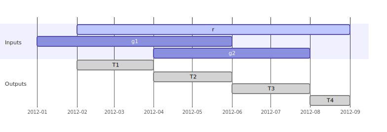

Note:

- So are they going to make temporal versions for all these?
    - It's very elegant.
- The paper introduces the idea of a temporal splitter.
- This is for the group-based operators we saw above, like aggregation.
  - You've got several tuples that get handled together to produce a result.
- The splitter takes one tuple and cuts it up so that the ends line up with other tuples from the group.


# Split Function

<pre><i>T</i> ∈ <i>split</i>(<i>r</i>, <b>g</b>) ⇐⇒
  <i>T</i> ⊆ <i>r.T</i> ∧
  ∀<i>g</i> ∈ <b>g</b>(<i>g.T</i> ∩ <i>T</i> = ∅ ∨ <i>T</i> ⊆ <i>g.T</i>) ∧
  ∀<i>T′</i> ⊃ <i>T(</i>∃<i>g</i> ∈ <b>g</b>(<i>T′</i> ∩ <i>g.T</i> ≠ ∅ ∧ <i>T′</i> ⊈ <i>g.T</i>) ∨ <i>T′</i> ⊈ <i>r.T</i>)</pre>


Note:

- So here is the definition of the split function.
- It returns a bunch of ranges, and each one fulfills three conditions:
    - Naturally the range is contained in the input range. (Line 2)
    - Next (line 3) for every tuple in the group, either the result doesn't touch it at all (the intersection is empty), or the result is contained in it.
        - None of these gray result tuples poke out of a group tuple.
    - Last, the result is maximal. In other words it's as big as it can be.
        - Without this condition, we could have more little ranges than needed, so this is giving us a result that is efficient and canonical.
        - The notation says that for any T' that would be bigger than T, we can't use it: either there is some g that intersects it without containing it, or else the input tuple doesn't contain it.
        - Note this is just a negation of either the third line or the second line.


# Normalize Operator

<pre><i>&#x0303;r</i> ∈ &#x1d4dd;<sub>B</sub>(<b>r</b>;<b>s</b>) ⇐⇒
  ∃<i>r</i> ∈ <b>r</b>(<i>&#x0303;r.A</i> = <i>r.A</i> ∧ <i>&#x0303;r.T</i> ∈ <i>split</i>(<i>r</i>, {<i>s</i> ∈ <b>s</b> | <i>s.B</i> = <i>r.B</i>}))</pre>

Note:

- We can use the split function to create a Normalize operator.
- Note the split function only outputs time spans, not full tuples.
- The normalize operator gives us the full tuples corresponding to those timespans.
- It's not communtative.
    - Normalize-r-with-respect-to-s gives us rs.
    - Normalize-s-with-respect-to-r gives us ss.
- The Normalize operator takes `B`, which is the attributes to group by.
    - So this is how we decide which group tuples belong in.
    - Recall that the split function took a single tuple on the left, and on the right a group of tuples.
        - (go back) that's why g is bold. Bold letters are relations, non-bold are single tuples.
    - I don't think we actually use B except for aggregation and projection.


# Align Function

- For tuple-based operators (`σ`, `×`, `⨝`, `⟕`, `⟖`, `⟗`, `▷`)
- Intersection with each tuple in the group
- Plus any part that is never intersected

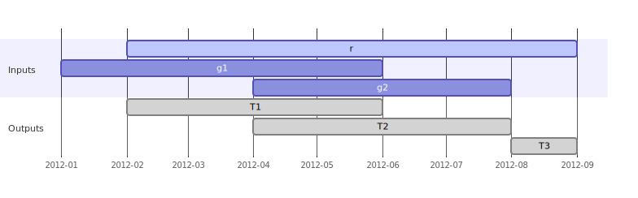

Note:

- On the other hand, for tuple-based operators we want an align function.
- It gives a separate intersection for each tuple in the group.
    - See here is an intersection with g1, and here with g2.
- Then it also gives a separate result for parts without a match.


# Align Function

<pre><i>T</i> ∈ <i>align</i>(<i>r</i>,<b>g</b>) ⇐⇒
  ∃<i>g</i> ∈ <b>g</b>(<i>T</i> = <i>r.T</i> ∩ <i>g.T</i> ) ∧ T ≠ ∅ ∨
  <i>T</i> ⊆ <i>r.T</i> ∧ ∀<i>g</i> ∈ <b>g</b>(<i>g.T</i> ∩ <i>T</i> = ∅) ∧
  ∀<i>T′</i> ⊃ <i>T</i>(∃<i>g</i> ∈ <b>g</b>(<i>T′</i> ∩ <i>g.T</i> ≠ ∅) ∨ <i>T′</i> ⊈ <i>r.T</i>)
</pre>


Note:

- Here is the align function's definition.
- Each result is either the second line, or the third-plus-fourth lines.
- The second line says it's a (non-empty) intersection with g,
- The third line say it's a part of r with no intersection in g.
- The fourth line says that it's maximal (or extends past r.T).
- But again we are only getting time spans, not full result tuples. . . .


# Align Operator

<pre><i>&#x0303;r</i> ∈ <b>r</b> Φ<sub>θ</sub> <b>s</b> ⇐⇒
  ∃<i>r</i> ∈ <b>r</b>(<i>&#x0303;r.A</i> = <i>r.A</i> ∧ <i>&#x0303;r.T</i> ∈ <i>align</i>(<i>r</i>,{<i>s</i> ∈ <b>s</b> | <i>θ</i>(<i>r,s</i>)}))</pre>

Note:

- So just as we built the Normalize operator with the split function,
  so now we build the Align operator with the align function.
- So r-align-s gives us all the r tuples with their timestamps replaced by the align function outputs.
- Of course we might get more than one r-squiggle for each r.


# Reduction Rules

|     |      |     |
| --- | ---- | --- |
| selection    | <code>σ<span class="supsub"><sup><i>T</i></sup><sub>θ</sub></span>(<b>r</b>)<code> | <code>= σ<sub>θ</sub>(<b>r</b>)</code> |
| projection   | <code>π<span class="supsub"><sup><i>T</i></sup><sub>B</sub></span>(<b>r</b>)<code> | <code>= π<sub>B,<i>T</i></sub>(&#x1d4dd;<sub>B</sub>(<b>r</b>;<b>r</b>)</code> |
| aggregation  | <code><sub>B</sub>ϑ<span class="supsub"><sup><i>T</i></sup><sub><i>F</i></sub></span>(<b>r</b>)</code> | <code>= <sub>B,<i>T</i></sub>ϑ<sub><i>F</i></sub>(&#x1d4dd;<sub>B</sub>(<b>r</b>;<b>r</b>))</code> |

Note:

- Now we have the tools to implement every temporal operator.
- Here are the unitary operators.
- Selection is boring:
    - This is filtering: but what SQL calls `SELECT`, but the `WHERE` clause.
    - There is no start/end time adjustment needed, so it's exactly like non-temporal selection.
- Projection seems like it'd be similar, but the authors are thinking about true set-based relational theory, whereas SQL is bag-based.
    - Set-based means you never get duplicates.
    - Since projection can omit attributes, you can wind up with duplicates you need to remove.
    - But that also means we need to adjust our timestamps.
- Aggregation requires normalizing for similar reasons.
    - Aggregation is interesting because the aggregation function might want the original start/end times or the normalized ones.
        - The paper calls this "extended snapshot reducibility".
    - These authors have a follow-up paper that also scales the aggregates based on the width of the interval.


# Reduction Rules

|     |      |     |
| --- | ---- | --- |
| difference   | <code><b>r</b> −<sup><i>T</i></sup> <b>s</b></code> | <code>= &#x1d4dd;<sub>A</sub>(<b>r</b>;<b>s</b>) − &#x1d4dd;<sub>A</sub>(<b>s</b>;<b>r</b>)</code> |
| union        | <code><b>r</b> ∪<sup><i>T</i></sup> <b>s</b></code> | <code>= &#x1d4dd;<sub>A</sub>(<b>r</b>;<b>s</b>) ∪ &#x1d4dd;<sub>A</sub>(<b>s</b>;<b>r</b>)</code> | 
| intersection | <code><b>r</b> ∩<sup><i>T</i></sup> <b>s</b></code> | <code>= &#x1d4dd;<sub>A</sub>(<b>r</b>;<b>s</b>) ∩ &#x1d4dd;<sub>A</sub>(<b>s</b>;<b>r</b>)</code> | 
<!-- .element class="r-fit-text" -->

Note:

- The set-based operators need to be normalized too.
- These all follow the same pattern:
    - Normalize r-with-respect-to-s on the left.
    - Normalize s-with-respect-to-r on the right.
- This seems easy enough.


# Reduction Rules

|     |      |     |
| --- | ---- | --- |
| cross join   | <code><b>r</b> ×<sup><i>T</i></sup> <b>s</b></code> | <code>= α((<b>r</b>Φ<sub><i>true</i></sub><b>s</b>) ⨝<sub><b>r</b>.<i>T</i>=<b>s</b>.<i>T</i></sub> (<b>s</b>Φ<sub><i>true</i></sub><b>r</b>))</code> |
| inner join   | <code><b>r</b> ⨝<sup><i>T</i></sup> <b>s</b></code> | <code>= α((<b>r</b>Φ<sub>θ</sub><b>s</b>) ⨝<sub>θ∧<b>r</b>.<i>T</i>=<b>s</b>.<i>T</i></sub> (<b>s</b>Φ<sub>θ</sub><b>r</b>))</code> |
| left join    | <code><b>r</b> ⟕<sup><i>T</i></sup> <b>s</b></code> | <code>= α((<b>r</b>Φ<sub>θ</sub><b>s</b>) ⟕<sub>θ∧<b>r</b>.<i>T</i>=<b>s</b>.<i>T</i></sub> (<b>s</b>Φ<sub>θ</sub><b>r</b>))</code> |
| right join   | <code><b>r</b> ⟖<sup><i>T</i></sup> <b>s</b></code> | <code>= α((<b>r</b>Φ<sub>θ</sub><b>s</b>) ⟖<sub>θ∧<b>r</b>.<i>T</i>=<b>s</b>.<i>T</i></sub> (<b>s</b>Φ<sub>θ</sub><b>r</b>))</code> |
| full join    | <code><b>r</b> ⟗<sup><i>T</i></sup> <b>s</b></code> | <code>= α((<b>r</b>Φ<sub>θ</sub><b>s</b>) ⟗<sub>θ∧<b>r</b>.<i>T</i>=<b>s</b>.<i>T</i></sub> (<b>s</b>Φ<sub>θ</sub><b>r</b>))</code> |
| antijoin     | <code><b>r</b> ▷<sup><i>T</i></sup> <b>s</b></code> | <code>= (<b>r</b>Φ<sub>θ</sub><b>s</b>) ▷<sub>θ∧<b>r</b>.<i>T</i>=<b>s</b>.<i>T</i></sub> (<b>s</b>Φ<sub>θ</sub><b>r</b>)</code> |
<!-- .element class="r-fit-text" -->

Note:

- Then we have all the joins.
- The alpha here is the absorb operator: it removes temporal duplicates.
- In all cases we use the corresponding non-temporal operator (join-to-join, left-join-to-left-join, etc), except for cross join we use a join. (Look carefully at that first line.)
    - At first I thought this might be a typo, but actually it is correct.
        - After aligning all overlapping tuples, and the only join condition is that the endpoints are equal,
          so this is still basically everything joined to everything.
        - Remember a cross join is just the cartesian product. It's like a join with no conditions.
            - So in temporal world, it's a join where the only condition is temporal overlap.
- In all cases it is r-align-s operator s-align-r.
    - Antijoin is the same; we just don't need the absorb operator.


# Extend Operator

<pre><i>z</i> ∈ ε<sub>U</sub>(<b>r</b>) ⇐⇒
  ∃<i>r</i> ∈ <b>r</b>(<i>z</i>.<b>A</b>=<i>r</i>.<b>A</b> ∧
         <i>z.U</i>=<i>r.T</i> ∧
         <i>z.T</i>=<i>r.T</i>)</pre>

Note:

- Now I want to jump back to the Extend Operator.
- This just takes the timestamps and copies them as regular attributes.
    - I was really puzzled about the point of this the first time I read the paper.
    - But I think at this point the motivation is more clear.
- When we normalize or align, we are changing the start/end times!
    - So the extend operator makes copies of the originals.
    - Then if our join condition or aggregation function wants them, it can use them.
    - The paper's examples illustrate this, e.g. taking the average duration of a stay.
        - To compute the duration, it needs the original start/end times.
        - Similarly we started with a left join between prices and reservations,
          and you get a better price the longer you stay.
          So we need to know the stay's original start/end times.


# Implementation

Postgres Query Pipeline

- Parse
- Analyze
- Rewrite
- Optimize
- Execute

Note:

- The authors actually implemented their ideas by patching Postgres!
    - The paper reports patching 9.0, and later they submitted a version to the pgsql-hackers mailing list during development for 9.6.
      They kept working on it up 'til version 12.
    - I remember when they submitted it to the hackers mailing list back in 2018.
        - It went through several rounds of revisions, but of course the authors are researchers, not open source developers.
        - Still their last communication said they are trying to split it into small bits.
        - They have led another more targeted patch recently, something called Range Merge Join, submitted in 2021.
          - I haven't seen anything on the mailing list for a couple years now.

- In Postgres a query flows through these stages.
- Parsing: we use a bison grammar to create structs holding what you typed.
    - You might get a parse error here, but we haven't done anything yet to interpret what you typed.
- Analysis: here we look up column names, check permissions, and in general make sense of your command.
    - Our goal is to build a tree of these special structs called Nodes.
    - It represents the logical structure of the query, e.g. joins, filters, expression trees, etc.
    - Every Node is like a subclass, but in C.
        - There are a few hundred node types.
        - There is a lot of infrastructure for copying them, printing them, making lists of them, etc.

- Rewrite: Mostly this just transforms database views into subqueries.
    - There are some other transforms that happen here as well, but not a lot.
    - The Node tree might get transformed, but it's the same kind of tree.

- Optimize: here Postgres generates multiple "paths" to implement your query, and compares their cost.
    - For instance which index should it use, if any?
    - In what order should it join your tables?
    - Should the joins be nested loops, merge joins, or hash joins?
    - So the input is a Query tree, and the output is a Plan tree.
        - They mostly use different kinds of Nodes.
    - Inside this phase we generate *multiple* Plan trees, but we only keep one.
        - We keep whichever one has the lowest estimated cost.
    - So the paper gives some formulas for computing the cost of their new operations.
        - Their formulas follow how Postgres estimates lots of other things:
            - There are tunable costs for random reads, sequential reads, CPU "operations", etc.
            - Then your node's cost function says, "I need 2n random reads and n-squared CPU operations", or whatever.

- Executor: actually do the work.
    - Each Plan node has function pointers (we might call them methods) to initialize the Node, run it, then shut it down.
    - The init functions build another Node tree, one-to-one with the Plan tree, so that each node has a place to store state.
        - This is called the State tree or the Exec tree.
    - When we run the Nodes, the run function gets called repeatedly.
        - Each time it returns one tuple, or NULL to indicate that it's done.
        - If a node has inputs, those are subnodes, and the node calls their run function to get each input tuple.
            - For instance imagine you have a join node.
                - It has two subnodes, one for each side, and it calls those to get the tuples to join.
        - This framework is what the paper refers to as "pipelining".
            - There are a few operations that have to read in all inputs before they can emit anything, like sorting or hash joins.
                - But if you can design your new Node to avoid that, you save memory, and you can start returning tuples sooner.

- So this patch adds stuff to all these phases.
    - Mostly they talk about the exec phase.
    - They have an ExecAdjustment function that produces aligned tuples.


# Executor Phase

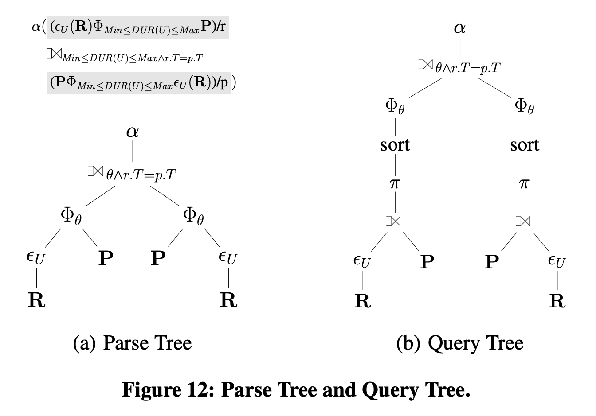

Note:

- Here is a diagram from the paper showing the parse tree vs the plan tree.
    - On the right, the capital-Phi align operator is the Adjustment node.
    - Now the mathematical operator has two operands, r & s, right?
    - But the Phi over here on the right has just one subnode.
    - That's because they are adding implicit left-join and sort nodes as their inputs.
        - I'm not sure what this project node is doing.
    - Originally they were doing this in the analysis phase, which people complained about.
        - That will mess up EXPLAIN output or using their operator in VIEWs.
        - I think they moved it to the rewrite phase, but I haven't checked the old patches to confirm.


# Left Join

```sql[|1|4,6|5,7-8|]
WITH R AS (SELECT Ts Us, Te Ue, * FROM R)
SELECT ABSORB n, a, min, max, r.Ts, r.Te
FROM
  (R ALIGN P ON DUR(Us, Ue) BETWEEN Min AND Max) r
  LEFT OUTER JOIN
  (P ALIGN R ON DUR(Us, Ue) BETWEEN Min AND MAX) p
  ON DUR(Us, Ue) BETWEEN Min AND Max
     AND r.Ts = p.Ts AND r.Te = p.Te
```

Note:

- Here is the SQL they suggest for implementing a temporal left outer join.
    - This follows the reduction rules they gave earlier.
- First they have a CTE which is just the Extends operator:
  - It selects everything and addes Us and Ue as copies of Ts and Te.
- Then they do the two ALIGNs.
    - This is syntax they added of course.
- Then they can do a non-temporal left join.
    - It uses the user-supplied join condition (about the stay duration)...
    - and it adds conditions to match the endpoints.

- I have a few remarks and questions here.
- The ALIGN steps need the join condition as well.
    - At **this** point (top x2) we could be using Ts and Te from r, since they haven't yet been changed,
    - But at **this** point (bottom) they have been adjusted, so we need Us and Ue.
- We are evaluating the join condition three times.
    - Is that excessive? Are we trading too much performance for the sake of elegance?
- How does ALIGN know that your endpoints are named Ts and Te?
    - From the paper it looks like they are just hardcoded.
    - In the actual patch they have a `USING` syntax to give the range column names.


# Evaluation

> To express a temporal outer join in SQL we have to express the join part using overlap predicates on timestamps and evaluate the negative part of the temporal outer join using joins and NOT EXISTS statements.[21]

Note:

- To benchmark their work they compared a temporal left join with their `ALIGN` operator vs one written completely in SQL.
- They did't put they SQL version in their paper, but they give Snodgrass's book as the reference.
    - I couldn't find any outer-join SQL in his book.
      [see page 413 and page 151 for CF 6.11 and 6.12 (CF = Code Fragment)?]
    - There are some join examples, but they don't seem like outer joins to me.
    - Maybe they are only footnoting the idea that an outer join is a join plus an antijoin. But Snodgrass seems like a weird reference to cite for that.
    - But I really wish the benchmarks were more reprodicible, because I have some questions about them, as we'll see.
    - I've emailed occasionally with the authors for several years, so I really need to ask about this.


# Evaluation

```sql
SELECT  a.*, b.*,
        UNNEST(multirange(a.valid_at) * multirange(b.valid_at)) AS valid_at
FROM    a 
JOIN    b
ON      a.id = b.id AND a.valid_at && b.valid_at
UNION ALL
...
```

Note:
- Here is some outer join SQL I wrote myself a few months ago.
- I used the same idea as the paper: that an our join is a regular join plus an antijoin.
- This is just the inner join part. . . .


# Evaluation

```sql
...
SELECT  a.*, (NULL::b).*,
        UNNEST(
          CASE WHEN j.valid_at IS NULL
               THEN multirange(a.valid_at)
               ELSE multirange(a.valid_at) - j.valid_at END
        )
FROM    a
LEFT JOIN (
  SELECT  b.id, range_agg(b.valid_at) AS valid_at
  FROM    b
  GROUP BY b.id
) AS j
ON      a.id = j.id AND a.valid_at && j.valid_at;
```

Note:

- This is the antijoin part.
- This is hard to do without multiranges, so I'm sure the author's SQL was something different. Probably a lot more complicated.
- I have a better SQL implementation than this,
  which is *not* join-plus-antijoin.
  - The join-plus-antijoin needs to scan the left table twice, right?
    - If you check EXPLAIN, that's how Postgres plans it.
  - But we shouldn't have to do that.
  - So even with multiranges, this still isn't the most optimaal.
  - But this is more like what the authors must have benchmarked against.


# Evaluation

O<sub>1</sub> = <b>r</b> ⟕<sup><i>T</i></sup><sub><i>true</i></sub> <b>s</b>
<br/>
D<sub><i>disj</i></sub> = disjoint intervals, D<sub><i>eq</i></sub> = equal intervals

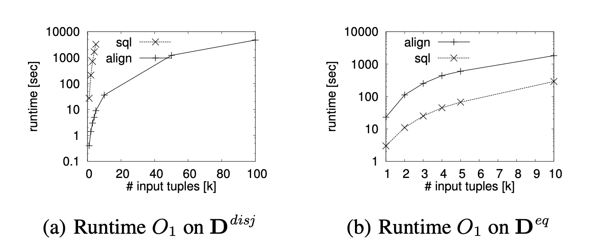

Note:

- They benchmarked a few different join conditions.
- Here is the first one.
    - They tried two different timestamp distributions.
- O1 was a temporal outer join between r and s, where every row matched every row (as long as their times overlap).
- I'm not sure you'd ever use this, but okay.
    - Then the disjoint distribution makes it even sillier: there are no overlapping intervals in the whole table.
      So I'm not sure what value this test really has.
      But still, it's helpful to know how a really degenerate case can blow things up.
- Their ALIGN operator is much faster.
- But they said there were no indexes on the table.
    - I would like to run the comparison with a GiST index on the valid time.

- They also ran O1 on a distribution where timestamps were equal.
    - That's not so realistic either, but in that case the SQL implementation is a bit faster.
    - They seem to have the same time complexity though.


# Evaluation

O<sub>2</sub> = <b>r</b> ⟕<sup><i>T</i></sup><sub><i>Min</i>≤<i>DUR</i>(<b>r</b>.<i>T</i>)≤<i>Max</i></sub> <b>s</b>

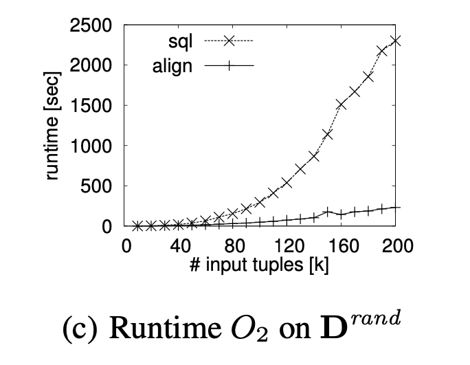 <!-- .element: style="width: 60%" -->

Note:

- Here is the join from the paper's main example, to price each reservation.
- They ran it on a random distribution of valid times, so it's not D-disjoint or D-equal.
- This is definitely more interesting than the last example.
    - But again, having no indexes makes it somewhat invalid.
    - Also note that this is still a synthetic dataset.


# Evaluation

O<sub>3</sub> = <b>r</b> ⟕<sup><i>T</i></sup><sub><b>r</b>.<i>pcn</i>=<b>s</b>.<i>pcn</i></sub> <b>s</b>

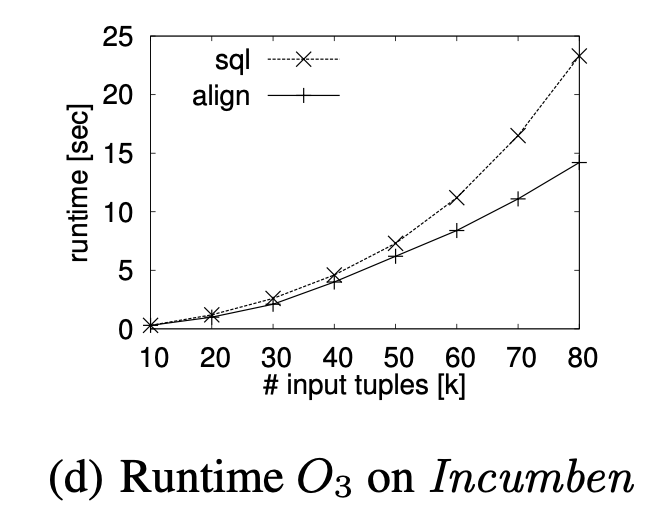 <!-- .element: style="width: 60%" -->

Note:

- O3 is a real query from a real dataset.
- It uses the Incumben dataset, comparing two sides on the position number.
    - I wish we had more details here.
        - I don't know what the Incumben dataset is.
            - I asked the authors but never heard back.
            - In the paper they say it's from the University of Arizona.
                - It's a bunch of employees and what positions they held.
                    - It's 50,000 employees and 80,000 positions.
            - The tables look exactly like the example tables in Snodgrass's book,
                - and btw Snodgrass is from the University of Arizona.
                - But Snodgrass doesn't give *data* for them.
                    - Even if you download the book CD, there's no data there.
                    - I really need to email him.
        - Also the query is a bit vague.
            - What are they matching to what? What are r and s?
            - I assume this isn't joining employees to positions, because employees don't have a position number.
            - But they meant to say they were joining by employee number?
                - There's a lot of unanswered questions here.
- But in theory, this is the most realistic of their benchmarks.
    - It's a real dataset.
    - We have an equijoin on a key, which is by far the most common way to join tables.
- There is still an advantage to the ALIGN version.
    - We don't see much divergence, but they also didn't let the input size grow as large as the other graphs.
- Once again, an index would make this a better test.

- Even though the authors have moved on and aren't still trying to get that original patch committed, I think there would be a lot of value in picking up where they left off.
    - I'll hopefully be done with the SQL:2011 stuff soon, and then I want to revisit all this.


# Thanks!
<!-- .slide: style="font-size: 50%" -->

#### This Talk

- https://files.ifi.uzh.ch/boehlen/Papers/modf174-dignoes.pdf
- https://github.com/pjungwir/temporal-alignment-talk

#### Research

- https://illuminatedcomputing.com/posts/2017/12/temporal-databases-bibliography/
- https://www2.cs.arizona.edu/~rts/publications.html
- http://citeseerx.ist.psu.edu/viewdoc/download;jsessionid=F78723B857463955C76E540DCAB8FDF5?doi=10.1.1.116.7598&rep=rep1&type=pdf
- http://www.zora.uzh.ch/id/eprint/130374/1/Extending_the_kernel.pdf
- https://github.com/pjungwir/temporal_ops

#### SQL:2011

- https://www.wiscorp.com/SQLStandards.html
- https://sigmodrecord.org/publications/sigmodRecord/1209/pdfs/07.industry.kulkarni.pdf

Note:

- The slides are on Github and include my speaker notes, so hopefully they are more useful than just the pictures.


# Thanks!

https://github.com/pjungwir/temporal-alignment-talk
